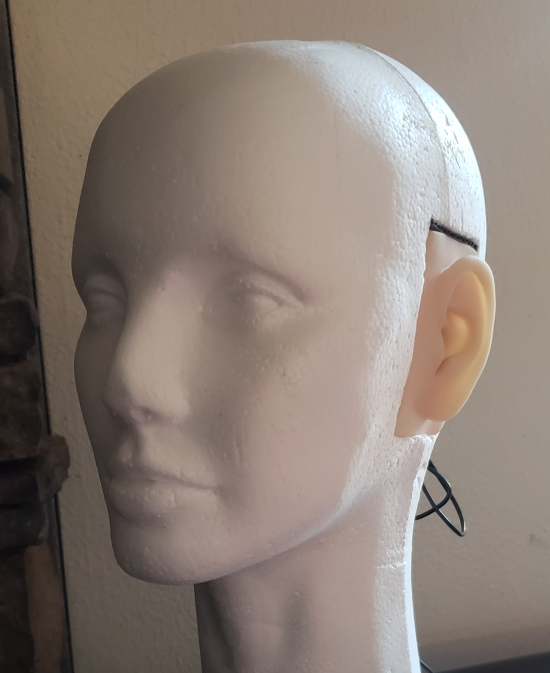

# Binaural Spatializer
Made by Emerson Peters

This project is an exploration of binaural audio synthesis. The source of inspiration for this is (well, it's cool, but also) for applying the concepts to a video game I am developing. I feel like video games focus heavily on graphics but don't give much love to audio. I would like to make my video game have very dynamic audio that reacts to the player's surroundings and has a spatial element to it.

# Dependencies
- scipy
- sounddevice
- matplotlib
- numpy

# Usage:
Simply call [main.py](main.py). Custom code can be placed there and use the `AudioEnv` class to create audio environments and apply spatial effects using them. I will not be creating a clean command line interface for this program, as the intention is for this code to be imported.

`/audio`
This contains input/output audio files from my program. [eld.wav](audio/eld.wav) is a short clip of me singing, and the others are of various effects applied to this clip.

`/hrirs`
This contains a set of head related impulse responses. The positions I decided to use were a normalized set of 3x3x3 vectors in the shape of a rubix cube. These were recorded using a custom head mic.

This was made using a styrofoam head, 2 silicone ears, 2 lav mics, and a 2 jacks to stereo adapter. The sounds were made by putting the mic in the center of the room, then pulling back and releasing a rubber band wrapped around a piece of card board. This is a fairly crude way to make impulse responses. There is quite a lot of echo from the room and the impulse response is not very flat. If I were to build upon this, I would need to find an anechoic chamber and use sine sweeps to synthesize better impulse responses. However, going forward I plan to find some publicly available sources for hrirs that are made using professional equipment and procedures.

# Results
I am partially satisfied with the result. It definitely applies a spatial quality to the audio, but it seems to be more of a general spatial echo than sounding specifically like a certain environment. I think this is a great result for the amount of time I've worked on it though. I think in the future I'll see if there's a way to simplify the representation and application of the audio enviroment. There is quite a lot of operations being done to the audio right now and I hope that this could eventually be used in a real-time game. The design also does not account for the material of the environment and I believe this would have a huge effect on the output. It also does not handle multiple bounces within an environment, so I'm wondering if some sort of feedback loop could be useful.

This is licensed under the [MIT License](LICENSE.txt). Feel free to use it as you would like!
